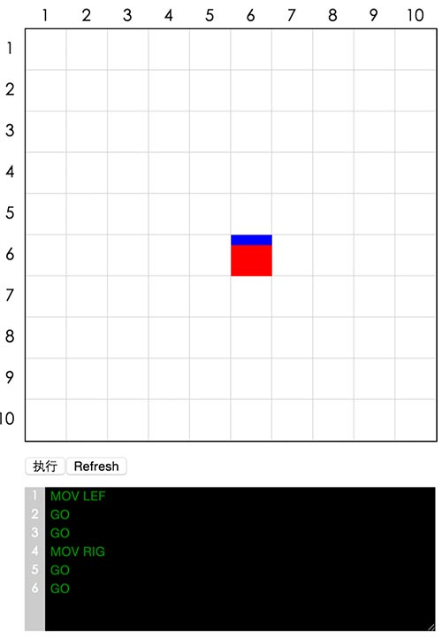
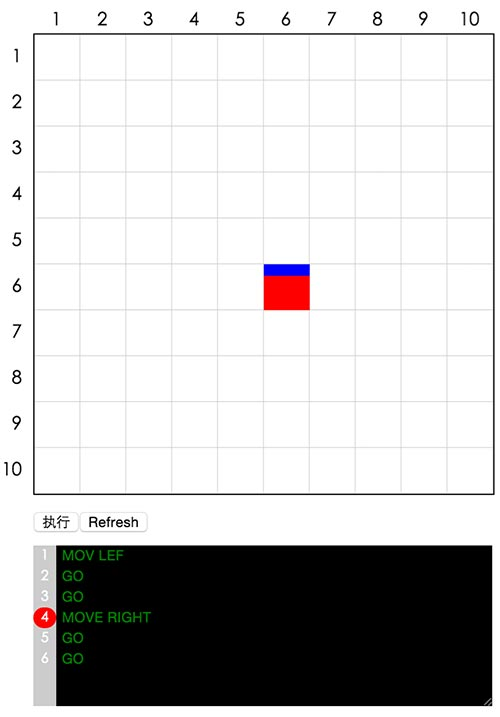

>任务三十五：听指令的小方块（三）
===

##任务目的
* 练习JavaScript在DOM、字符串处理相关知识
* 练习对于复杂UI，如何进行数据机构建模

##任务描述

* 如图，命令输入框由input变为textarea，可以允许输入多条指令，每一行一条
* textarea左侧有一列可以显示当前行数的列（代码行数列），列数保持和textarea中一致
* 当textarea发生上下滚动时，代码行数列同步滚动

* 能够判断指令是否合法，不合法的指令给出提示（如图）
* 点击执行时，依次逐条执行所有命令
* 对于GO，TRA以及MOV指令增加可以移动格子数量的参数，例如
* GO 3：向当前方向前进三格
* TRA TOP 2：向屏幕上方平移两格
* MOV RIG 4：方向转向屏幕右侧，向屏幕的右侧移动四格

##任务注意事项
* 实现功能的同时，请仔细学习JavaScript相关的知识
* 请注意代码风格的整齐、优雅
* 代码中含有必要的注释
* 建议不使用任何第三方库、框架

##在线学习参考资料
* [JavaScript入门篇](http://www.imooc.com/view/36)
* [MDN JavaScript](https://developer.mozilla.org/zh-CN/docs/Web/JavaScript)
